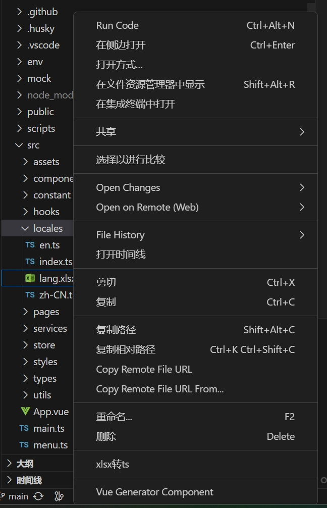

# wa-window

窗口工具

---

功能整理

- xlsxToTs xlsx文件转lang配置文件 并自动翻译(目前仅支持 中、英、繁、韩、日)
- createRfc 生成rfc组件
- createVue 生成vue组件
- createClass 生成class
- 翻译 配合百度appid appkey 翻译文本




## 插件配置

1. xlsxDefaultLan
   xlsx首选默认语言 其他语言空值时使用默认语言进行填充

   例(xlsx内容)
   | key | zh-CN | en |
   | ------- | ----- | --- |
   | message | 你好 | |

   生成结果

   ```typescript
   // zh-CN.ts
   export default {
     message: "你好",
   };
   // en.ts
   export default {
     message: "你好",
   };
   ```

2. xlsxTransformPath

   转换保存的文件路径 没有的话自动创建路径
   默认值 /src/locales
   以默认值为例 生成目录为

   ```
   ├── src
   │   ├── locales
   │   │     ├──zh-CN.ts
   │   │     └──en.ts
   ```

3. xlsxTransformType
   转换文件(类型｜后缀)
   目前仅支持 ts or js
   默认值ts
   以xlsxTransformPath案例
   改为js 生成的是zh-CN.js

4. autoTranslate
   是否需要自动翻译
   需要搭配 baiduAppid baiduKey一起使用

5. baiduAppid
   百度翻译api appId
   可搭配autoTranslate实现xlsxToTs自动翻译
   也可以在ctrl + t中 >翻译 快速翻译文案

6. baiduKey
   百度翻译api appKey
   取值规则

```typescript
/**
 * package.json
 * {
 * "config": {
 *    "wa-menus": {
 *       "xlsxDefaultLan": "",
 *       "xlsxTransformPath": "",
 *       "xlsxTransformType": ""
 *       }
 *    }
 * }
 * 大于
 * 设置->扩展
 * */
```

# todo

## 须知

xlsx第一行为表头 单元格为需要的语言
所有的语言必须都补充上
xlsx会在读取时忽略掉第一行是空值的列
插件的开启在xlsx文件时无法开启 需要切到ts or js or json文件后再点击xlsx右键生效
